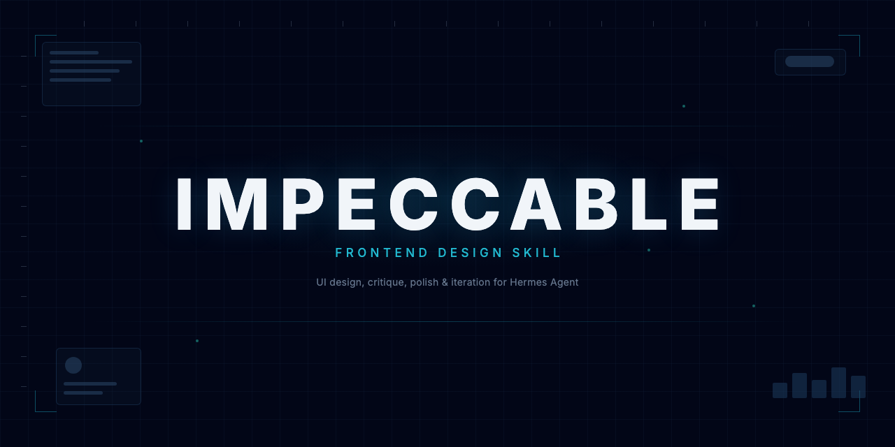

# Impeccable for Hermes Agent

<p align="center">
  
</p>

<!-- docs/banner.png is rendered from docs/banner.html with headless Chrome at 1280x640. -->

[pbakaus/impeccable](https://github.com/pbakaus/impeccable), the frontend design skill, packaged for [Hermes Agent](https://github.com/NousResearch/hermes-agent). It shapes, critiques, audits, polishes and refines UI: real working code, committed design choices, and a mechanical anti-pattern detector.

This repo tracks upstream's generated Hermes build release by release (see [`UPSTREAM`](UPSTREAM) for the pinned tag) and adds a small Hermes overlay on top:

- `metadata.hermes` tags and related skills.
- A description that leads with its routing signal, because Hermes' system-prompt skill index keeps only the first 57 characters.
- A setup note telling the agent to resolve `scripts/impeccable` from the `skill_dir` that `skill_view` returns, so global installs work (upstream's fallback path assumes a project-local install), and to call it through `sh`, since hub installs on Hermes releases before hermes-agent#133316 drop its executable bit.

## Install

```bash
dest="${HERMES_HOME:-$HOME/.hermes}/skills/creative/impeccable"
git clone https://github.com/DevvGwardo/impeccable /tmp/impeccable
mkdir -p "$dest" && cp -R /tmp/impeccable/{SKILL.md,reference,scripts} "$dest/"
```

Use the manual copy for now. On current Hermes releases, every hub form of this repo's identifier (`DevvGwardo/impeccable/`, `github/...`, the GitHub URL) is captured by Hermes' official `impeccable` catalog entry and installs upstream's bundle without this overlay. Hub installs also drop the launcher's executable bit. Both are fixed upstream in [NousResearch/hermes-agent#133317](https://github.com/NousResearch/hermes-agent/pull/133317) and [#133316](https://github.com/NousResearch/hermes-agent/pull/133316); once they ship, this works too:

```bash
hermes skills install DevvGwardo/impeccable/ --category creative
```

The trailing slash matters: it tells Hermes the skill sits at the repo root.

`hermes skills install impeccable` installs upstream's Hermes bundle from pbakaus/impeccable directly, without the overlay described above. So does upstream's own installer: `npx impeccable install --providers=hermes --scope=global`.

The first command that needs the engine downloads a self-contained binary for your platform from upstream's GitHub releases, verifies it against its `.sha256`, and caches it in `~/.impeccable` (override with `IMPECCABLE_HOME`, or point `IMPECCABLE_BIN` at a preinstalled engine). No Node is required.

A project-scoped install goes in `<project>/.hermes/skills/impeccable/` instead; run `hermes skills trust` once from the project root, since Hermes gates project-local skills behind a per-repo trust decision.

## Use

Ask for design work in plain language, or name a command: `/impeccable audit the checkout page`. With no argument the skill shows a menu based on your project's state.

| Command | Category | Description |
|---|---|---|
| `init` | Build | Capture durable product context in PRODUCT.md (`teach` is an alias) |
| `document` | Build | Generate DESIGN.md from existing project code |
| `shape [feature]` | Build | Plan UX/UI before writing code |
| `extract [target]` | Build | Pull reusable tokens and components into the design system |
| `critique [target]` | Evaluate | UX design review with heuristic scoring |
| `audit [target]` | Evaluate | Technical quality checks (a11y, perf, responsive) |
| `polish [target]` | Refine | Final quality pass before shipping |
| `bolder` / `quieter` / `distill` | Refine | Amplify, tone down, or strip to essence |
| `harden [target]` | Refine | Errors, i18n, overflow, edge cases |
| `onboard [target]` | Refine | First-run flows, empty states, activation |
| `animate` / `colorize` / `typeset` / `layout` | Enhance | Motion, color, typography, spacing and rhythm |
| `delight` / `overdrive` | Enhance | Personality; technically extraordinary effects |
| `clarify` / `adapt` / `optimize` | Fix | UX copy, device adaptation, UI performance |
| `live` | Iterate | Pick elements in the browser and iterate on variants |
| `generate [n] [action] [element]` | Iterate | Variants of a named element in the live browser |
| `doctor` | Maintain | Report and repair drift in PRODUCT.md, DESIGN.md and config |

Surfaces are designed in one of four modes: **Persuade** (landing, marketing, pricing), **Operate** (app UI, dashboards, tools), **Read** (docs, articles) and **Experience** (portfolios, galleries). iOS and Android projects get native-platform references.

Hermes has no edit-hook surface, so the `hooks` command (auto-running the detector after each UI edit) does nothing here. The skill runs the detector itself at the end of a change, and you can run it by hand:

```bash
sh ~/.hermes/skills/creative/impeccable/scripts/impeccable detect --json src/
```

## Updating

```bash
tools/sync-upstream.sh               # latest upstream skill-v* release
tools/sync-upstream.sh skill-v4.5.0  # a specific release
```

The script replaces `SKILL.md`, `reference/`, `scripts/`, `LICENSE` and `NOTICE.md` from upstream's `.hermes/skills/impeccable/` build at that tag, reapplies `tools/overlay.py`, and runs `tools/check.sh` (unrendered placeholders, broken reference links, the launcher, and Hermes' own `skills_guard` install scan when a local `hermes-agent` checkout exists). A weekly GitHub Action does the same and opens a pull request when upstream ships a new release.

## License

Apache 2.0, same as upstream. See [LICENSE](LICENSE) and [NOTICE.md](NOTICE.md).

## Credits

- [Paul Bakaus](https://github.com/pbakaus): Impeccable
- [Anthropic](https://www.anthropic.com): the frontend-design skill it builds on
- [Nous Research](https://nousresearch.com): Hermes Agent
